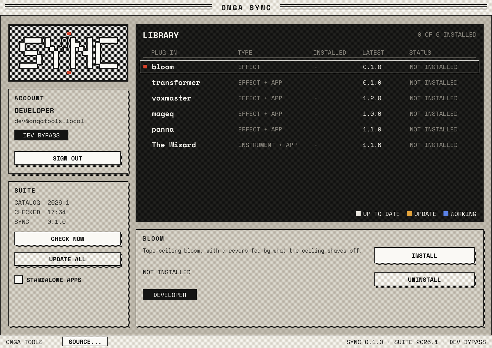
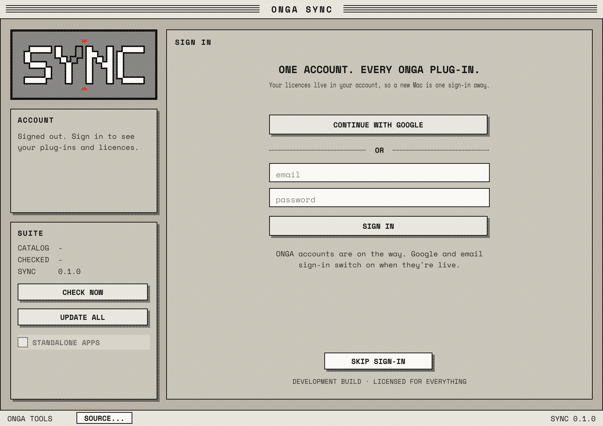

# ONGA Sync

The ONGA plug-in library for macOS, in the spirit of UA Connect: one app that installs,
updates and uninstalls every ONGA plug-in, and (soon) holds your licences in your ONGA
account. This repo holds the app and the release pipeline, no plug-in code. CI checks out
each plug-in repo at a pinned ref, builds universal (Apple Silicon + Intel) bundles,
packages each one, and publishes them with a `catalog.json` the app reads.

 

| Plug-in | Repo | Type | Formats |
|---|---|---|---|
| bloom | `benettriley/onga_bloom` | effect | AU, VST3 |
| transformer | `benettriley/onga_transformer` | effect | AU, VST3, app |
| voxmaster | `benettriley/voxmaster` | effect | AU, VST3, app |
| mageq | `benettriley/mageq_onga` | effect | AU, VST3, app |
| panna | `benettriley/panna` | effect | AU, VST3, app |
| the wizard | `benettriley/TheWiz` | instrument | AU, VST3, app |

## The app

`app/` is a JUCE 8 app built on the shared [onga-ui](https://github.com/benettriley/onga_v1_UI)
kit (a submodule), laid out at 820 x 580 and scaled as a unit like every ONGA panel.

- **Library screen**: every plug-in with its installed and latest version. Click one for
  INSTALL / UPDATE / REINSTALL / UNINSTALL. **UPDATE ALL** updates everything at once.
  **STANDALONE APPS** adds the apps to installs.
- **Updates**: the app reads the catalog on launch, every 6 hours and on **CHECK NOW**.
  When the catalog carries a newer ONGA Sync, **UPDATE SYNC** installs it and offers a
  restart.
- **Installs** download each package, check its size and SHA-256, then run one script as
  root behind the standard macOS password prompt (`installer -pkg ... -target /`).
- **Uninstall** moves the AU, VST3 and app (current and earlier names, system-wide and
  per-user) to the Trash and forgets the receipts. Presets and settings stay.
- **Account**: sign in once; licences come down with the account.

### Accounts and licences

`app/Source/core/Account.h` is the seam. `IdentityService` is what the ONGA account
service will implement: Google sign-in (browser + loopback redirect) and email/password,
both returning an `Account` with tokens and licences (`perpetual`, `subscription`,
`trial`, with expiry). Installs are gated on `licenseFor (plugin)`.

Until the service exists, `NotLiveYet` answers every call and the sign-in form is greyed
out. **Development builds** (`-DONGA_SYNC_DEV_BYPASS=ON`, the default for now) add
**SKIP SIGN-IN**: a developer account licensed for everything, marked DEV BYPASS in the
footer. A release build ignores a developer session left on disk. Switch the option off
once real sign-in lands.

Settings and the session live in `~/Library/Application Support/ONGA/Sync`.

### Catalog

```json
{ "schema": 1, "suite": "2026.1",
  "sync": { "version": "0.1.0", "url": "ONGA-Sync-0.1.0.pkg", "sha256": "…", "size": 123 },
  "packages": [
    { "id": "wizard", "name": "the wizard", "bundle": "the wizard", "version": "1.1.6",
      "type": "instrument", "blurb": "…",
      "plugin": { "url": "wizard-1.1.6.pkg", "sha256": "…", "size": 123 },
      "app": { "url": "wizard-app-1.1.6.pkg", "sha256": "…", "size": 123 },
      "oldNames": [], "receipts": ["com.ongatools.wizard.install", "…"] } ] }
```

URLs are relative to the catalog, so the same file works from the latest release
(the default: `releases/latest/download/catalog.json`), a test pre-release, or a folder on
disk. Development builds have a **SOURCE…** button in the footer to point at any of them.

> **Hosting:** the app downloads without credentials, so the release files must be
> public. Either make this repo public (it holds no plug-in source) or move the release
> files to public storage and set `-DONGA_SYNC_CATALOG_URL=…`.

### Building and testing

```sh
git submodule update --init
cmake -S app -B build -DCMAKE_BUILD_TYPE=Release
cmake --build build --target OngaSync OngaSyncCli
build/OngaSyncCli_artefacts/Release/OngaSyncCli test
```

`OngaSyncCli` is the app's core without the UI: `test` (unit tests, any OS), `check`,
`verify`, `install-script`, `uninstall-script`. CI runs the scripts it prints with `sudo`,
so the install and uninstall paths the app uses are the ones that get tested.
`ONGA_SYNC_SNAPSHOT=/path/shot.png` makes the app render its window to a PNG and quit.

## What a release holds

- `ONGA-Sync-<v>.dmg`: **Install ONGA Sync.pkg** (the app), **Uninstall ONGA.pkg**
  (every ONGA plug-in, app and ONGA Sync itself, to the Trash) and READ ME.txt.
- `catalog.json` and the packages it names: `<id>-<v>.pkg` (AU + VST3), `<id>-app-<v>.pkg`,
  `ONGA-Sync-<v>.pkg`.
- `ONGA-Suite-<suite>.pkg`: offline, every plug-in in one go with one checkbox each.

Each plug-in package's `preinstall` moves copies under earlier names (ONGA BLOOM,
Voxmaster, magEQ, PANNA, PANNAVISIO…) to the Trash, matching exact names because APFS
ignores case; `postinstall` clears quarantine and refreshes the Audio Unit cache. Plug-in
codes never change, so saved sessions still open.

## Releasing

Everything the library ships is listed in [`suite.sh`](suite.sh).

1. Tag the plug-in repo, e.g. `git tag v0.1.1 && git push origin v0.1.1` in `onga_bloom`.
2. In `suite.sh`, set that plug-in's `TAG`, and bump `SUITE_VERSION`. (Bump
   `project(OngaSync VERSION …)` in `app/CMakeLists.txt` to ship a new app.)
3. Push, and check the build on the **Actions** tab.
4. Tag this repo `v<SUITE_VERSION>` (e.g. `v2026.1`) and push the tag. CI publishes the
   release; every installed ONGA Sync sees it on its next check.

To try branches before tagging, run the workflow by hand with **ref_override** set to a
branch that exists in every plug-in repo; tick **test_release** to publish a pre-release
the app can be pointed at with SOURCE….

## CI

`.github/workflows/build.yml`:

1. `plan` reads the plug-in list from `suite.sh`.
2. `build` builds each plug-in on `macos-14` (`scripts/build_plugin.sh`) and checks that
   every binary is universal.
3. `app` builds ONGA Sync and `OngaSyncCli` (universal) and runs the core tests.
4. `assemble` builds everything (`scripts/assemble.sh`), then on the runner: installs the
   offline suite with apps and runs `codesign --verify` and `auval` on all of it;
   uninstalls; installs the app; downloads and checksums every catalog file with the
   app's downloader; installs every package with the app's install script and checks the
   app sees them as current; screenshots the app; uninstalls each plug-in with the app's
   uninstall script; checks nothing is left behind.

**Required secret:** `ONGA_REPOS_TOKEN` (or `ONGA_SYNC`): a token that can read the private
plug-in repos (a classic token with the `repo` scope).

## Signing and notarisation (off for now)

Everything is ad-hoc signed until there's an Apple Developer ID. Ad-hoc signing is enough
for Apple Silicon hosts to load the plug-ins, but users have to right-click the pkg and
choose **Open** the first time. To switch signing on, add these secrets. Nothing else
changes:

| Secret | What |
|---|---|
| `MACOS_CERTS_P12`, `MACOS_CERTS_PASSWORD` | Base64 `.p12` holding the *Developer ID Application* and *Developer ID Installer* certificates, and its password |
| `APP_SIGN_IDENTITY` | `Developer ID Application: Name (TEAMID)`: signs the bundles, the app and the DMG, with hardened runtime |
| `INSTALLER_SIGN_IDENTITY` | `Developer ID Installer: Name (TEAMID)`: signs the pkgs |
| `NOTARY_APPLE_ID`, `NOTARY_TEAM_ID`, `NOTARY_PASSWORD` | Turn on notarisation and stapling (app-specific password) |

## Building a release locally (macOS)

```sh
git clone --recursive https://github.com/benettriley/onga_bloom src/bloom   # etc.
./scripts/build_plugin.sh bloom src/bloom bundles
# …one build_plugin.sh per plug-in…
mkdir -p syncapp && ditto "build/OngaSync_artefacts/Release/ONGA Sync.app" "syncapp/ONGA Sync.app"
echo 0.1.0 > syncapp/VERSION
./scripts/assemble.sh bundles dist syncapp
```

Then point a development build's **SOURCE…** at `dist/packages` to try the whole flow.
